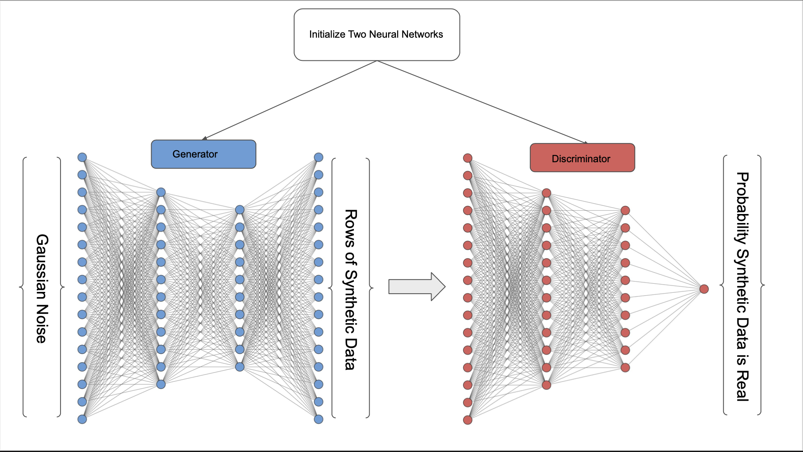
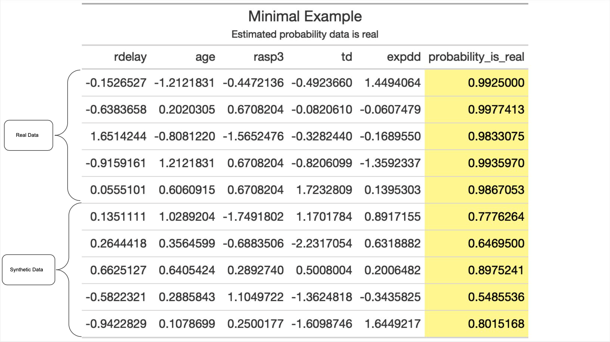
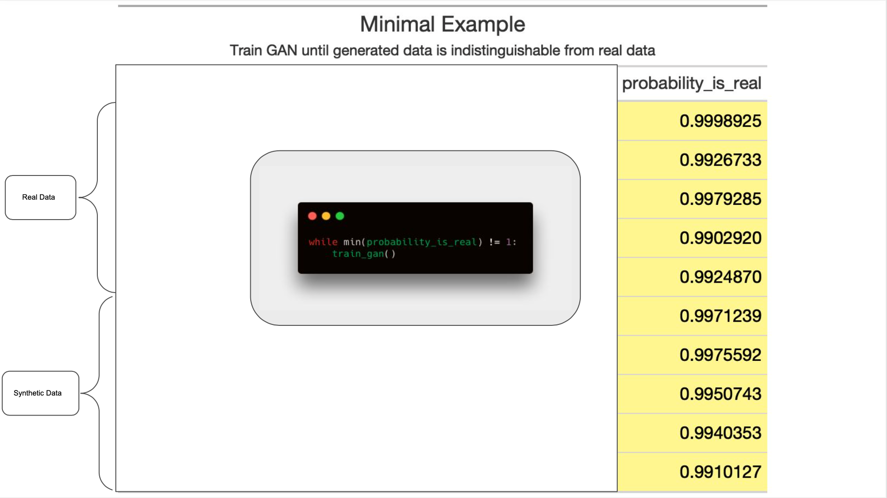
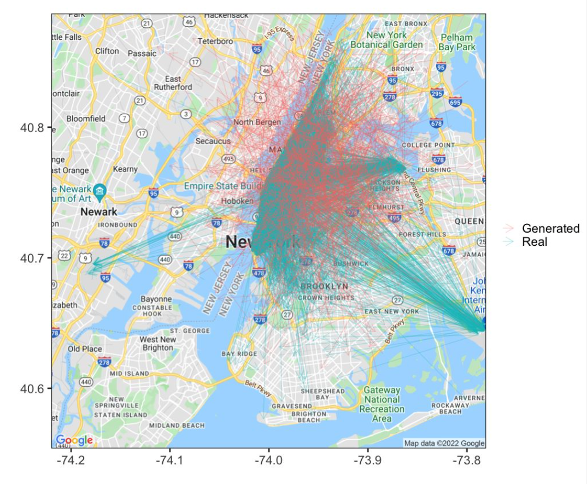

## Neural Network Project

The goal here is to generate additional data samples from a structured dataset using a Generative Adversarial Network. 

# Replication instructions

## Set up

Begin by cloning the repo and installing the packages

```zsh
git clone https://github.com/despresj/ece_colab.git
python3 -m venv ece884_project_enviroment
source ece884_project_enviroment/bin/activate
pip install -r requirements.txt
```

After that load some libraries.

```python
import os
import pandas as pd
import numpy as np
from sklearn.preprocessing import MinMaxScaler
```

Then import the functions created for this project. Read the code [here](https://github.com/despresj/ece_colab/blob/main/tools/train.py)

```python
from tools.train import build_network, train_gan # functions from project
```

import and scale the data. Note that any tabular data set with numeric columns will (hopefully) work. 

```python
df = pd.read_csv("data_clean/taxi_sample.csv") # data is a small subset of the full nyc taxi data
data_columns = df.columns
scaler = MinMaxScaler().fit(df)
df = scaler.transform(df)
```

Train and generate data.

```python
for _ in range(5000):
    # these GANS often converge to one point,
    # these randomized hyper parameters prevent it getting stuck on one solution
    neurons = np.random.randint(8, 25)
    hidden = np.random.randint(5, 10)
    noise_n = np.random.randint(125, 150)
    epochs = np.random.randint(75, 100)
    learna = np.random.exponential(1e-2)
    learnb = np.random.exponential(1e-2)

    generator = build_network(output_dim=df.shape[1], n_hidden=hidden, n_neurons=neurons, learning_rate=learna)
    discriminator = build_network(output_dim=1, n_hidden=hidden, n_neurons=neurons, learning_rate=learnb) 
    
    gen_data = train_gan(generator, discriminator, df, n_epochs=epochs, n_noise=noise_n)
    output_path = "generated_data.csv"
    generated_data = pd.DataFrame(scaler.inverse_transform(gen_data), columns=data_columns) 
    generated_data.to_csv(output_path, mode='a', header=not os.path.exists(output_path), index=False)
```

## Basic Structure of a GAN[2]






### See the majority of the data generated are plausable.

Although plausable, these require significant curiation.



